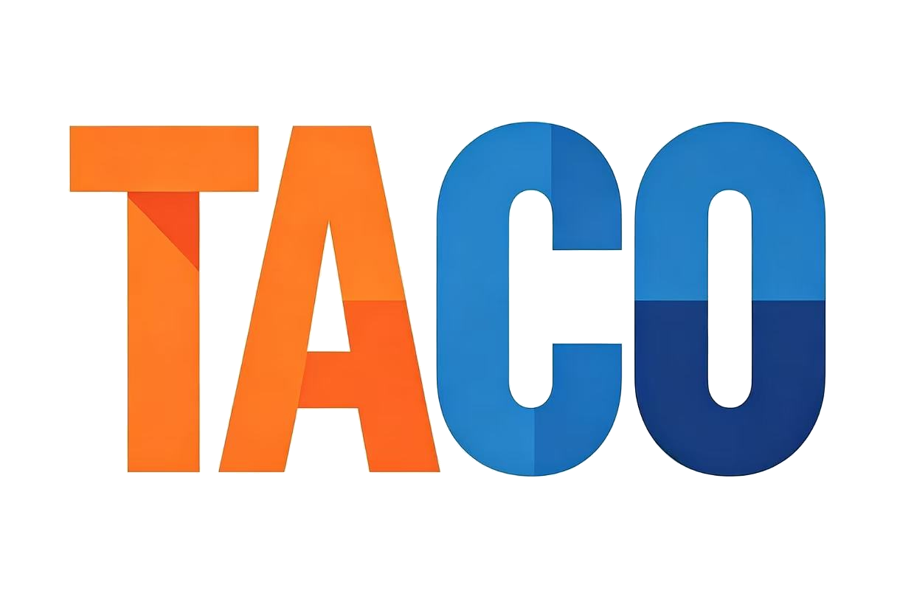
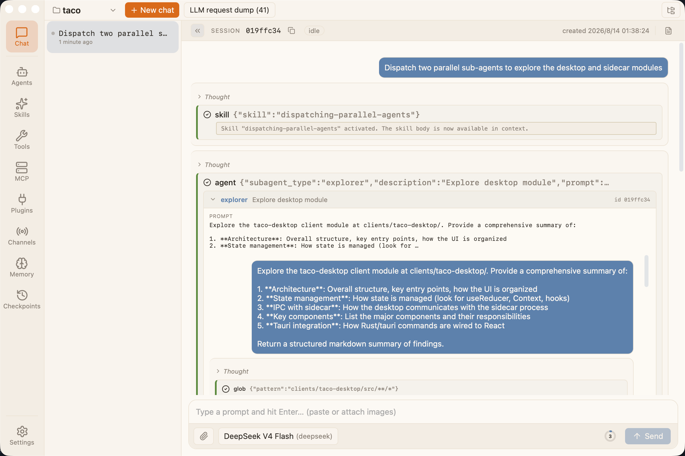

# Taco

[English](README.md) · [中文](README.zh.md)

<p align="center">
  
</p>

A minimal sidecar protocol layer + multi-client debug terminal built on Pi's `pi-agent-core` AgentHarness, exposing an NDJSON-over-stdio JSON-RPC surface so any client in any language can drive multi-workspace, multi-session agent conversations.

Taco ships four packages: the sidecar server (`@taco-ai/sidecar`), the typed Node client (`@taco-ai/shared`), the wire contract (`@taco-ai/protocol`), and the Tauri 2 + React desktop (`@taco-ai/desktop`).

## Project Highlights

- **`agent` tool.** Per-type tool whitelist, `agent/<type>` namespace, depth-bounded recursion, `executionMode: "parallel"` for concurrent calls.
- **`skill` tool.** Loads by name; inline enqueues `<skill_body:NAME>` protected by `skillReinjector`, subagent mode spawns a fresh session via `spawnSkillSubagent`.
- **Plan mode.** `planEnter` opens `.taco/plans/<slug>.md`; only read / askUser / write-the-plan are allowed; `planExit` returns the plan for approval.
- **Prompt tag system.** Each `<tag>` carries a `compression` policy (`pin` / `pinOnce` / `summarize` / `drop`) and `tuiVisibility` (`visible` / `hidden` / `ephemeral`).
- **Extension system.** Workspace activation builds a frozen `WorkspaceExtensionSet` from process + workspace contributions. Built-ins: `projectManifests`, `gitContext`, `outputRedaction`. Register new tags via `registerExtensionTag`.
- **JSONL storage.** Sessions / history / event logs go through `JsonlSessionStorage` + `JsonlSessionRepo` — append-only, replayable, no schema migrations.
- **Pi as a dependency.** `pi-agent-core` and `pi-ai` pinned at `^0.83.0`; consumes upstream APIs directly.
- **Standalone deploy.** `@taco-ai/sidecar` is a standalone npm package with its own bin; the Tauri desktop embeds it, but any stdio-capable runtime drives it directly.
- **One process, many workspaces.** One `taco-sidecar` serves every workspace the UI has open, routed by `cwd`. Tenant isolation = start another process.

## What's Next

- **Plan / Tasks / Memory keep refining.** Reminder cadence, hook ordering, extraction prompt quality are still evolving.
- **Coding strength lands in extensions.** Patches / refactors / test runners go through the extension system.
- **Harden the safety envelope.** `PermissionBroker` already isolates read-only subagents and supports per-workspace IM policies; sandboxing and finer-grained IM policy are next.

## Repository Layout

```
taco/
├── packages/
│   ├── protocol/              # Wire contract (types + constants)
│   ├── shared/                # Typed Node client + spawn helper
│   └── sidecar/               # NDJSON over stdio service process
├── clients/
│   └── taco-desktop/          # Tauri 2 + React desktop client
├── examples/
│   ├── python-cli/            # Python integration sample
│   └── node-tui/              # Node TUI integration sample
├── docs/                      # Design docs + protocol spec
├── assets/                    # Images
└── scripts/                   # Repo-level scripts
```

## Quick Start

<p align="center">
  
</p>

```bash
git clone <repo> taco
cd taco
pnpm install
```

### Run the sidecar

```bash
cd packages/sidecar
pnpm dev   # tsx watch, NDJSON on stdio
```

On startup the sidecar writes `sidecar.hello` and waits for stdin. Drive it from another terminal with any NDJSON-aware client.

### Run the desktop

```bash
cd clients/taco-desktop
pnpm install
pnpm tauri:dev
```

Tauri WebView opens with the sidebar (workspaces + sessions) and a chat pane. The shared `taco-sidecar` process is launched by the Rust backend on first `workspace_ensure` and shared across all open workspaces (see [docs/02-architecture.md](docs/02-architecture.md) §2.8).

> Debug builds run from repo source; release builds run the staged bundle, handled by `stageSidecar.mjs`.

## Protocol

Taco enforces a two-step handshake (mandatory since v1.0):

```
1. server writes:  sidecar.hello   { version, pid, instanceId, protocol }
2. client sends:   initialize      { protocolVersion, clientCapabilities }
   server replies: initialize      { serverVersion, serverCapabilities }
```

`initialize` must succeed before any other RPC is accepted; clients that only read hello are rejected with `not_initialized` on their first real call.

Full wire spec: [docs/sidecar-protocol.md](docs/sidecar-protocol.md). Regenerate with `pnpm sidecar:docs` after RPC changes.

## Third-Party Integration

`@taco-ai/sidecar` is published to npm as a standalone process; any language with a stdio interface can drive it.

```bash
npm i -g @taco-ai/sidecar
```

| Language | Example | Description |
|----------|---------|-------------|
| Python | [examples/python-cli/](examples/python-cli/) | Zero deps, `subprocess.Popen` + stdlib |
| Node.js | [examples/node-tui/](examples/node-tui/) | Uses `@taco-ai/shared` typed client |

```typescript
import { TacoClient } from "@taco-ai/shared/node";
import { createDefaultSidecarSpawn } from "@taco-ai/shared/spawn";

const client = new TacoClient(
    createDefaultSidecarSpawn({ command: "taco-sidecar", args: [] }),
);

await client.start();
await client.waitForReady();  // await hello + complete initialize handshake
client.onPush((frame) => console.log("[push]", frame.method));

await client.workspaceList();
const { sessionId } = await client.sessionCreate({ workspace: cwd, initialPrompt: "hello" });
await client.sessionPrompt(cwd, sessionId, "echo ping");
```

## License

MIT — see [LICENSE](LICENSE).