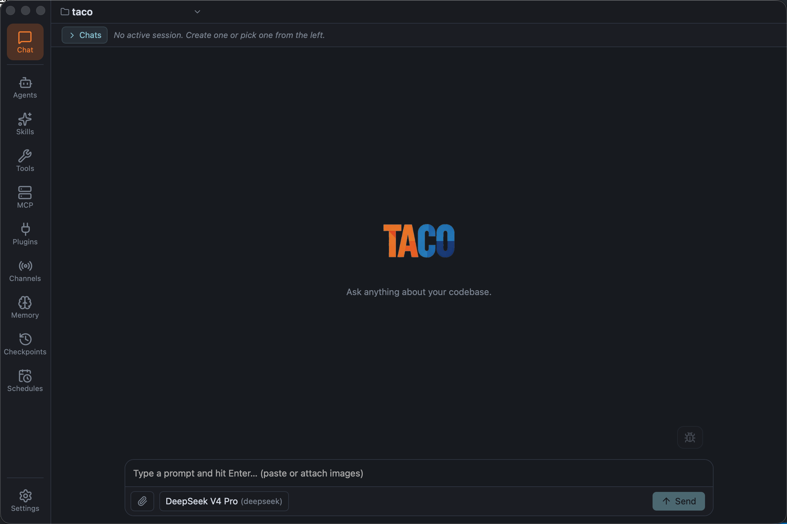

# Taco

[English](README.md) · [中文](README.zh.md)

<p align="center">
  
</p>

Taco 是一个极简 sidecar 协议层 + 多客户端调试终端，基于 Pi 的 `pi-agent-core` AgentHarness 构建，以 NDJSON-over-stdio JSON-RPC 接口暴露，使任何语言、任何客户端都能驱动多工作区、多会话的 agent 对话。

包含：sidecar 服务端（`@taco-ai/sidecar`）、Node 类型化客户端（`@taco-ai/shared`）、协议合约（`@taco-ai/protocol`）和 Tauri 2 + React 桌面端（`@taco-ai/desktop`）。

## 项目特色

- **`agent` 工具。** 按类型白名单隔离工具，`agent/<type>` 命名空间，深度限制递归，`executionMode: "parallel"` 并发调用。
- **`skill` 工具。** 按名称加载；inline 模式入队 `<skill_body name="NAME">` 受 `skillReinjector` 保护的消息，subagent 模式通过 `spawnSkillSubagent` 启动独立 session。
- **Plan 模式。** `planEnter` 创建 `.taco/plans/<slug>.md`，期间只允许读 / askUser / 写方案；`planExit` 返回计划待审批。
- **Prompt tag 系统。** 每个 `<tag>` 声明 `compression`（`pin` / `pinOnce` / `summarize` / `drop`）和 `tuiVisibility`（`visible` / `hidden` / `ephemeral`）。
- **扩展系统。** workspace 激活时合并进程级 + workspace 级贡献为冻结的 `WorkspaceExtensionSet`；内置 `projectManifests` / `gitContext` / `outputRedaction`，通过 `registerExtensionTag` 注册新 tag。
- **JSONL 存储。** Session / 历史 / event log 走 `JsonlSessionStorage` + `JsonlSessionRepo`，append-only、可重放、无 schema 迁移。
- **Pi 为依赖。** `pi-agent-core` 与 `pi-ai` 锁定 `0.85.1`，直接消费上游 API。
- **独立部署。** `@taco-ai/sidecar` 是独立 npm 包，有自己的 bin；支持两种运行模式 —— 直接 `NDJSON over stdio`（任何语言都能这样驱动）和 `taco start` / 桌面端使用的常驻 daemon 模式。daemon 模式下的租户隔离是「换一个 control endpoint」，不是「再起一个进程」。
- **一 daemon 多 workspace。** 桌面端 daemon 服务 UI 中打开的所有 workspace，按 `cwd` 路由；同一 NDJSON socket 可承载多客户端并发。

## 接下来

- **Plan / Tasks / Memory 持续打磨。** reminder 节奏、hook 顺序、extraction prompt 质量等细节仍在迭代。
- **Coding 能力走扩展。** 打补丁 / 重构 / 测试运行器通过扩展系统接入。
- **加固安全边界。** `PermissionBroker` 已支持 read-only 子代理隔离和按 workspace 的 IM 策略；沙箱化（Gondolin 或同类）、更细粒度的 IM 策略是下一步。

## 目录结构

```
taco/
├── packages/
│   ├── protocol/              # 协议合约（类型 + 常量）
│   ├── shared/                # Node 类型化客户端 + spawn helper
│   └── sidecar/               # NDJSON over stdio 服务进程
├── clients/
│   └── taco-desktop/          # Tauri 2 + React 桌面客户端
├── examples/
│   ├── python-cli/            # Python 接入示例
│   └── node-tui/              # Node TUI 接入示例
├── docs/                      # 设计文档 + 协议规范
├── assets/                    # 图片资源
└── scripts/                   # 仓库级脚本
```

## 跑起来

<p align="center">
  
</p>

```bash
git clone <repo> taco
cd taco
pnpm install
```

### 启动 sidecar

```bash
cd packages/sidecar
pnpm dev   # tsx watch,stdio 输出 NDJSON
```

启动后 sidecar 直接进入可服务状态，等待 stdin 接收 `initialize` RPC（协议 v2+）。可用任意 NDJSON 客户端驱动。

### 启动桌面端

```bash
cd clients/taco-desktop
pnpm install
pnpm tauri:dev
```

Tauri WebView 打开后显示侧边栏（workspaces + sessions）+ 聊天面板。Rust 后端在首次 `workspace_ensure` 时拉起 `taco-sidecar` 子进程，所有打开的 workspace 共享（详见 [docs/02-architecture.md](docs/02-architecture.md) §2.8）。

> Debug 构建跑仓库源码，release 构建跑 staged bundle；stage 由 `stageSidecar.mjs` 完成（见 [stageSidecar.mjs](clients/taco-desktop/scripts/stageSidecar.mjs) 与 [`lib.rs::resolve_sidecar`](clients/taco-desktop/src-tauri/src/lib.rs)）。

### 首次启动的 macOS / Windows 提示

由于公开发布的安装包尚未使用付费证书签名，操作系统可能会在首次启动时显示一次「未受信任」提示。请只从仓库所有者发布的 release 页面下载安装包，不要为其它来源绕过任何提示。

**macOS — Gatekeeper「无法打开，因为无法验证开发者」：**

1. 关闭提示框，打开 **系统设置 → 隐私与安全性**。
2. 滚到页面底部，会看到一条记录："无法打开 Taco，因为开发者无法识别"。
3. 点击该条目右侧的 **仍要打开**，再在弹出的对话框里确认。
4. macOS 会记住你的选择，之后该安装包不会再提示。

如果找不到"仍要打开"按钮（首次拦截后只显示约 1 小时），或者你更倾向于对已确认来源的应用手工清除隔离属性，可以执行：

```bash
# 清除单个已下载应用的隔离属性
xattr -dr com.apple.quarantine "/Applications/Taco.app"
```

需要单独清除某个文件时，把路径换为该文件，并使用 `xattr -d com.apple.quarantine <file>`。`xattr` 仅修改指定文件的扩展属性，并不会关闭系统级安全机制。

**Windows — SmartScreen「Windows 已保护你的电脑」：**

1. 在 SmartScreen 弹窗中点击 **更多信息**。
2. 弹窗会展开显示发布者名称（可能为"未知"）和 **仍要运行** 按钮。
3. 点击 **仍要运行** 完成启动。

不要为绕过该提示而关闭 SmartScreen 或 Windows Defender。等安装包在后续 release 中获得签名证书后，SmartScreen 的信誉会逐步累积；在此之前，"更多信息 → 仍要运行" 是官方推荐的放行方式。

如果提示变为「此应用已被阻止以保护你」或「此应用无法安装，因为它可能有危害」，说明 SmartScreen 信誉已低于阈值。请取消安装，从官方 release 页面重新下载，不要绕过该警告。

## 协议

Taco 强制两步握手（自 v1.0）：

```
1. client sends:   initialize      { protocolVersion, clientCapabilities }
   server replies: initialize      { serverVersion, serverCapabilities, instanceId, pid }
```

`initialize` 成功后才接受其他 RPC。v2 不再发送 v1 的 `sidecar.hello` 推送帧，身份信息（version/pid/instanceId）合并到 initialize 响应中。

完整协议见 [docs/sidecar-protocol.md](docs/sidecar-protocol.md)。修改 RPC 后用 `pnpm sidecar:docs` 重新生成。

## 第三方接入

`@taco-ai/sidecar` 已发布 npm，任何支持 stdio 的语言均可驱动。

```bash
npm i -g @taco-ai/sidecar
```

| 语言 | 示例 | 说明 |
|------|------|------|
| Python | [examples/python-cli/](examples/python-cli/) | 零依赖，`subprocess.Popen` + 标准库 |
| Node.js | [examples/node-tui/](examples/node-tui/) | 使用 `@taco-ai/shared` 类型化客户端 |

Node.js 示例：

```typescript
import { TacoClient } from "@taco-ai/shared/node";
import { createDefaultSidecarSpawn } from "@taco-ai/shared/spawn";

const client = new TacoClient(
    createDefaultSidecarSpawn({ command: "taco-sidecar", args: [] }),
);

await client.start();
await client.handshake();    // 协议 v2+: initialize RPC; 返回 InitializeResult
client.onPush((frame) => console.log("[push]", frame.method));

await client.workspaceList();
const { sessionId } = await client.sessionCreate({ workspace: cwd, initialPrompt: "hello" });
await client.sessionPrompt(cwd, sessionId, "echo ping");
```

## License

MIT — see [LICENSE](LICENSE)。
