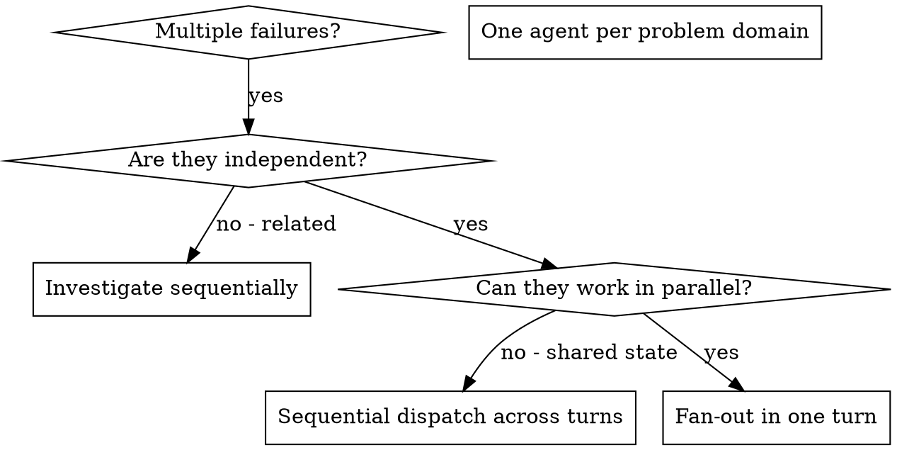

# Fan-Out Agents

## Overview

You delegate independent tasks to specialised subagents by issuing multiple `agent` tool calls in the **same assistant turn**. Each call spawns its own sub-session with an isolated tool whitelist; they run concurrently through the harness's parallel-execution path. You construct exactly what each subagent needs — they never inherit your session context or history, which keeps your main context free for coordination.

When you have multiple unrelated failures (different test files, different subsystems, different bugs), investigating them sequentially wastes turns. Each investigation is independent and can happen in parallel.

**Core principle:** dispatch one `agent` call per independent problem domain, all inside one turn. The harness runs them concurrently — your turn does not block on each one in series.

## When to Use



**Use when:**
- 3+ test files failing with different root causes
- Multiple subsystems broken independently
- Each problem can be understood without context from others
- No shared state between investigations (different files, different modules, different bugs)

**Don't use when:**
- Failures are related (fixing one might fix others — investigate together first)
- You need full-system context the subagent cannot reconstruct from a self-contained prompt
- Subagents would interfere with each other (editing the same files, racing on the same resource)
- The task is exploratory — you don't yet know what's broken

## The Pattern

### 1. Identify Independent Domains

Group failures by what's broken:
- File A tests: tool-approval flow
- File B tests: batch-completion behaviour
- File C tests: abort functionality

Each domain is independent — fixing the tool-approval flow does not affect abort tests.

### 2. Pick the Right `subagent_type`

Match the subagent type by capability, not by tool overlap. The harness enforces per-depth tool whitelists; pick the narrowest type that can finish the job:

- `explorer` — read-only search/tracing; **cannot modify files** (right for diagnosis: read code, summarise findings)
- `verification` — adversarial tester; runs builds, tests, checks; returns PASS/FAIL/PARTIAL verdict

If neither built-in matches, list available types via the system-prompt `tool_summary` block (see `agents.list` RPC) — user-defined `.taco/agents/<name>.md` entries appear there too.

### 3. Compose Self-Contained Prompts

Each subagent gets:
- **Specific scope** — one file, one subsystem, one bug
- **Clear goal** — what "done" looks like
- **Constraints** — what they must NOT touch (other files, production code, etc.)
- **Expected output** — exact shape of the returned text

**Do not** assume the subagent knows anything about your conversation, the parent task, or sibling subagents. Each prompt is the only context they will see.

### 4. Dispatch in One Turn

Issue all `agent` calls in the same assistant message. The harness detects every call's `executionMode` and runs `Promise.all` over the batch when none are `sequential`:

```text
agent(subagent_type=explorer, description="...", prompt="...")   # tc-1
agent(subagent_type=explorer, description="...", prompt="...")   # tc-2
agent(subagent_type=explorer, description="...", prompt="...")   # tc-3
# All three spawn concurrently. Your turn does not serialise them.
```

> **Important — keep the batch pure.** If even one call in the same turn is a `sequential` tool (most write tools, askUser, planEnter/planExit), the harness degrades the **entire batch** to sequential. If you need a sequential prerequisite, do it in the **previous** turn so the fan-out batch stays pure.

> **Important — `parentToolCallId` is unique per call.** Each `agent` invocation carries a different `toolCallId`, so the harness routes every subagent's `subagent.spawned` push and live `session.event` stream to the right card on the desktop. You do not need to coordinate IDs.

### 5. Review and Integrate

When subagents return:
1. Read each summary — they are independent, treat them as parallel reports.
2. Verify fixes do not conflict (overlapping file edits, shared test fixtures).
3. Run the full test suite yourself in the main session — do not delegate verification to a subagent that just made changes.
4. Integrate all changes.

## Agent Prompt Structure

Good prompts are:

1. **Focused** — one clear problem domain.
2. **Self-contained** — all context the subagent needs to understand the problem.
3. **Specific about output** — what the subagent should return in `resultText`.

```markdown
Fix the 3 failing tests in `packages/sidecar/tests/tools/agent.test.ts`:

1. "should abort tool with partial output capture" — expects 'interrupted at' in message
2. "should handle mixed completed and aborted tools" — fast tool aborted instead of completed
3. "should properly track pendingToolCount" — expects 3 results but gets 0

These are timing / race-condition issues. Your task:

1. Read the test file and understand what each test verifies.
2. Identify the root cause — timing issues or actual bugs?
3. Fix by:
   - Replacing arbitrary timeouts with event-based waiting
   - Fixing bugs in the abort implementation if found
   - Adjusting test expectations if behaviour legitimately changed

Do NOT just increase timeouts — find the real issue.

Return: a short summary of root cause and the changes you made (file paths + one-line descriptions).
```

## Common Mistakes

**❌ Too broad:** "Fix all the failing tests" — subagent gets lost.
**✅ Specific:** "Fix `packages/sidecar/tests/tools/agent.test.ts`" — focused scope.

**❌ No context:** "Fix the race condition" — subagent does not know where.
**✅ Context:** paste the failing test names, expected vs actual values, the file path.

**❌ No constraints:** subagent may refactor everything.
**✅ Constraints:** "Do not change production code" or "Fix tests only".

**❌ Vague output:** "Fix it" — you do not know what changed.
**✅ Specific:** "Return summary of root cause and changes" — concrete deliverable.

**❌ Mixing execution modes in one batch:** adding one `edit` (sequential) call alongside three `agent` (parallel) calls makes the whole batch sequential — you lose the speedup. Keep parallel-only batches together.

## When NOT to Use

**Related failures** — fixing one may fix others. Investigate together first.
**Need full context** — understanding requires the entire system in view.
**Exploratory debugging** — you do not yet know what is broken.
**Shared mutable state** — subagents would race on the same files, ports, env vars.

## Real Example

**Scenario:** six test failures across three files after a major refactor.

**Failures:**
- `agent.test.ts`: 3 failures (timing issues)
- `agentContinue.test.ts`: 2 failures (tools not executing)
- `sessionSnapshot.test.ts`: 1 failure (execution count = 0)

**Decision:** independent domains — abort logic separate from batch completion separate from race conditions.

**Dispatch (all in one turn):**

```
agent(subagent_type=explorer, description="diag agent.test.ts timing", prompt="...paste failing test names + paths...")
agent(subagent_type=explorer, description="diag agentContinue batch", prompt="...paste failing test names + paths...")
agent(subagent_type=explorer, description="diag sessionSnapshot count", prompt="...paste failing test names + paths...")
```

**Integration:** all fixes independent, no conflicts, full suite green.

## Verification

After subagents return:

1. **Review each summary** — understand what changed.
2. **Check for conflicts** — did subagents edit the same code? (If yes, you probably should have used one subagent, not three.)
3. **Run the full suite yourself** — verify all fixes work together; do not trust a subagent's "PASS" report.
4. **Spot-check the diff** — subagents can make systematic errors (wrong import path, off-by-one in test setup).

## Mode Constraint

This skill is **inline-only**. It must be invoked through the `skill` tool's inline path so its body lands in your current context and guides the tool-call composition of the same turn. It must **not** be declared with `runAs: subagent` in its frontmatter — running it in a subagent would defeat the purpose, because the subagent would not have access to your session state and could not dispatch `agent` calls back into your session. If you see this skill executing inside a subagent, that is a misconfiguration; load it in the main session instead.
